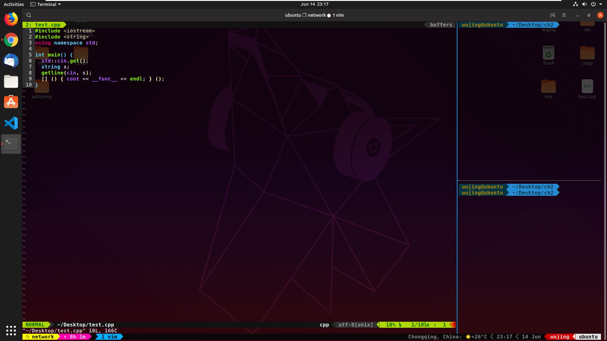

## 删除原来的 ctags

    $ sudo apt-get remove ctags # ctags 的重新安装
    $ sudo apt-get autoremove

## 安装 ssh

生产 ssh 密钥，使用 github ssh 下载：

    $ ssh-keygen -t rsa -C "wujinggrt@foxmail.com"

需要把 id_rsa.pub 的内容放入 github 账号的 SSH 中才能够使用这个协议，才能够用 SSH 下载 rather than http

## 安装所有需要的工具集

    $ sudo apt-get install git tmux autoconf automake libncurses5-dev python-dev python3-dev libatk1.0-dev libxpm-dev libxt-dev libbonoboui2-dev  cmake  build-essential fonts-powerline nodejs npm clang clang-tools-8 zsh

Ubuntu 19-04 是不用重新编译 vim，因为自带 vim 8，需要重新配置 universal-ctags

## plug-vim

    $ curl -fLo ~/.vim/autoload/plug.vim --create-dirs \
    https://raw.githubusercontent.com/junegunn/vim-plug/master/plug.vim

ctags 还需要注意放 `.root` 文件到工程目录或者 `home` 反正上一级，否则不能正常补全

## YCM 还需要到目录去

    $ python3 install.py --clangd-completer

## clangd 配置

    $ sudo update-alternatives --install /usr/bin/clangd clangd /usr/bin/clangd-8 100
    $ clangd --version

然后在 `.vimrc` 添加：

    " Let clangd fully control code completion
    let g:ycm_clangd_uses_ycmd_caching = 0
    " Use installed clangd, not YCM-bundled clangd which doesn't get updates.
    let g:ycm_clangd_binary_path = exepath("clangd")
    let g:ycm_clangd_args = ['-log=verbose', '-pretty']

完成配置

## instant-markdown 配置

    $ sudo npm -g install instant-markdown-d

## zsh 配置

### 替换默认的 shell

    $ chsh -s  $(which zsh)

### zsh 主题 poerlevel10k

    $ git clone https://github.com/romkatv/powerlevel10k.git ~/powerlevel10k
    $ echo 'source ~/powerlevel10k/powerlevel10k.zsh-theme' >>! ~/.zshrc

## 工具 autojump

    $ git clone git://github.com/wting/autojump.git
    $ cd autojump
    $ ./install.py or ./uninstall.py

然后根据提示添加设置到 .zshrc 或者 .bashrc

## 安装 universal-ctags

### 从 github 下载

在上面的工具安装完了之后

    $ git clone https://github.com/universal-ctags/ctags.git # or git@github.com:universal-ctags/ctags.git $ cd ctags
    $ sudo ./autogen.sh
    $ ./configure --prefix=/usr/local/universal-ctags

### 编译和安装路径的设置

    $ make -j8
    $ sudo make install
    $ sudo rm /usr/bin/ctags
    $ sudo ln -s /opt/software/universal-ctags/bin/ctags  /usr/bin/ctags

## 编译安装最新版本 vim

Ubuntu 19-04 自带 vim 8，不需要这么麻烦。但是其他如果不是的话，需要这么做。

    $ dpkg -l | grep vim
    $ sudo apt-get remove vim vim-runtime vim-tiny vim-common 
    $ git clone https://github.com/vim/vim.git # or git@github.com:vim/vim.git
    $ sudo ./configure --with-features=huge --enable-multibyte --enable-rubyinterp --enable-pythoninterp --enable-python3interp --enable-luainterp --enable-cscope --enable-gui=gtk3 --enable-perlinterp --with-python-config-dir=/usr/lib/python2.7/config-x86_64-linux-gnu/ --with-python3-config-dir=/usr/lib/python3.6/config-3.6m-x86_64-linux-gnu/ --prefix=/usr/local/vim
    $ sudo make
    $ sudo make install
    $ sudo ln -s /usr/local/vim/bin/vim /usr/bin/vim
    $ sudo ln -s /usr/local/vim/bin/view /usr/bin/view

### 配置解释

* --with-features=huge：支持最大特性
* --enable-rubyinterp：打开对 ruby 编写的插件的支持
* --enable-pythoninterp：打开对 python 编写的插件的支持
* --enable-python3interp：打开对 python3 编写的插件的支持
* --enable-luainterp：打开对 lua 编写的插件的支持
* --enable-perlinterp：打开对 perl 编写的插件的支持
* --enable-multibyte：打开多字节支持，可以在 Vim 中输入中文
* --enable-cscope：打开对cscope的支持
* --enable-gui=gtk3 表示生成采用 GNOME3 风格的 gvim
* --with-python-config-dir=/usr/lib/python2.7/config-x86_64-linux-gnu/ 指定 python 路径
* --with-python3-config-dir=/usr/lib/python3.6/config-3.6m-x86_64-linux-gnu/ 指定 python3路径
* --prefix=/usr/local/vim：指定将要安装到的路径

## superuser

    $ sudo passwd # 创建新的超级用户密码

## tmux 的源

    $ git clone git@github.com:gpakosz/.tmux.git

## Chrome 和常用软件，常用 setting

安装 Chrome 安装插件 vimium setupvpn,

从 `Ubuntu Software` 中搜索和安装 `vscode`

从 setting->power 中 blink screnn 选择 never, 取消锁屏

Ubuntu chrome 不能在拓展中安装插件：
选择左上角的开发者模式，然后按 F5，之后就可以直接拖住安装。

## 成果

